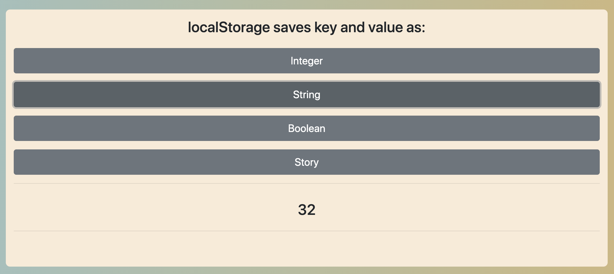
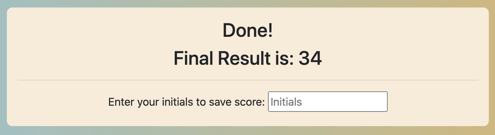
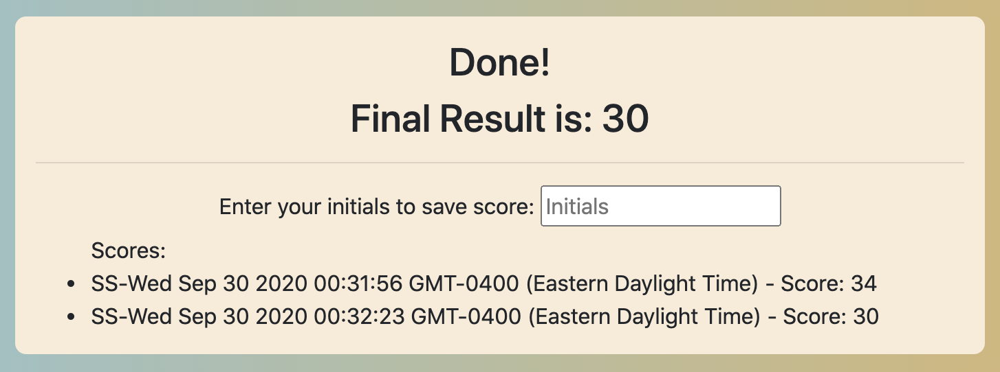

# coding-quiz
Quick cozy cool quiz game implementing DOM, Events, Timers, LocalStorage. 

# How Does It Work?
The timer is set to 60 seconds to answer 5 questions related to localStorage. 

The countdown starts just after loading the page. There are 4 options to answer each question. 

If the wrong answer is clicked, the timer will be reduced by 10. The score will be the remaining time after answering the last question. 

If the time is over before completing the quiz, you get no score. 

After answering all 5 questions, you get the option to save your score.

# Links:

* [repo on GitHub](https://github.com/samergain/coding-quiz)
* [deployed application](https://samergain.github.io/coding-quiz/)

# Screenshot 

# Future Improvements:
* Add a starting page with short description and a "start quiz" button
* Filter localStorage to highlight the Topscore so far

# Credit & Sources
* Big THANK YOU to Kieran Anthony for sharing great links on how to deal with localStorage.
* Bootstrap 4 - used for main layout and elements
* [Looping over localStorage](https://www.youtube.com/watch?v=k8yJCeuP6I8&ab_channel=dcode)
* [Date Objects](https://www.w3schools.com/js/js_dates.asp)

